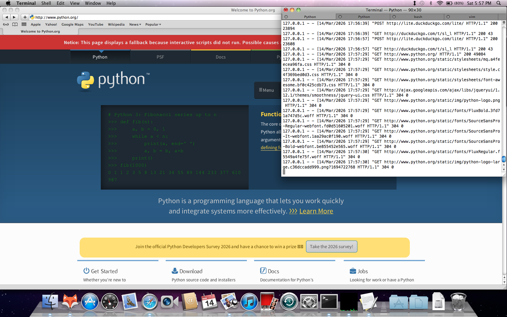

# HTTP to HTTPS Proxy

This is a basic lightweight HTTP to HTTPS web proxy made to browse modern HTTPS site using older browsers with minimal requirements. This has been tested against Safari 5.1.10 (6534.59.10) on Mac OSX Snow Leopard 10.6.8 on a 2011 Macbook Pro and this code exists for my own personal enjoyment. If it doesn't work for you, you're free to fork this project and make changes but I will not provide any support. If you're going to use this proxy to surf the internet on old browsers I recommend disabling Javascript in the browser settings. This proxy will not filter any javascript from requests!

This uses Python's standard library http.server which is not hardened and is not suitable for use in a production environment. **USE AT YOUR OWN RISK!**



## Quick start

I've packaged the newest version of Python that I was able to install in Snow Leopard in this repository. Install Python and run these commands to get this server running:

```sh
python3 -m venv env
source env/bin/activate
pip install -r requirements.txt
python3 threadedsimplehttpserver.py
```

Then you should open up System Preferences > Network > Advanced and set your HTTP proxy to localhost:5000

## Websites that mostly work in Safari 5.1.10

- http://lite.duckduckgo.com/lite/
- http://macintoshgarden.org/ - This site works without a proxy
- http://www.python.org/
- http://1mb.club/ - This site doesn't render perfectly but it is a good resource for finding other sites that work in older browsers
- http://xhtml.club/
- http://cygwin.com
